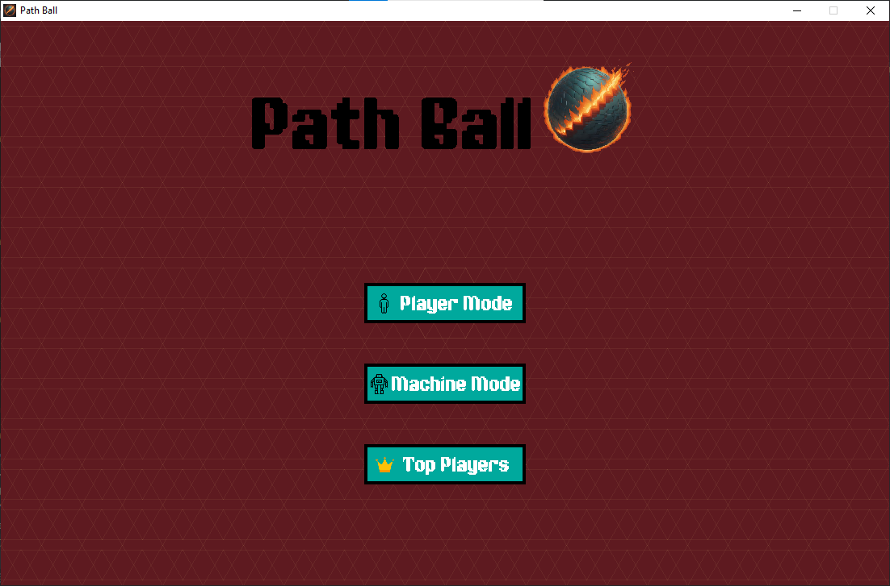
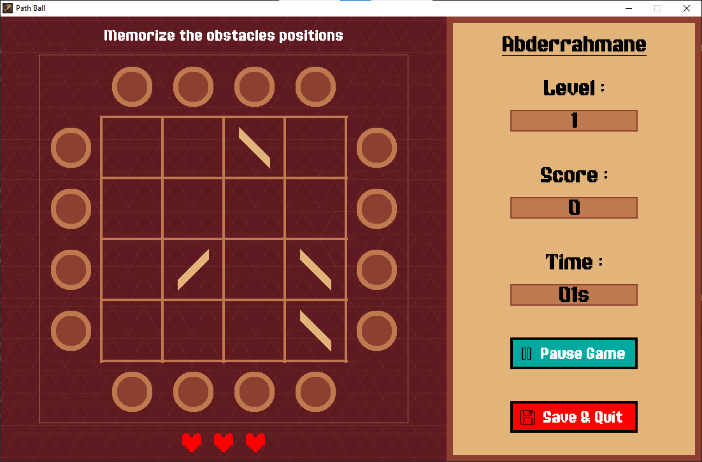
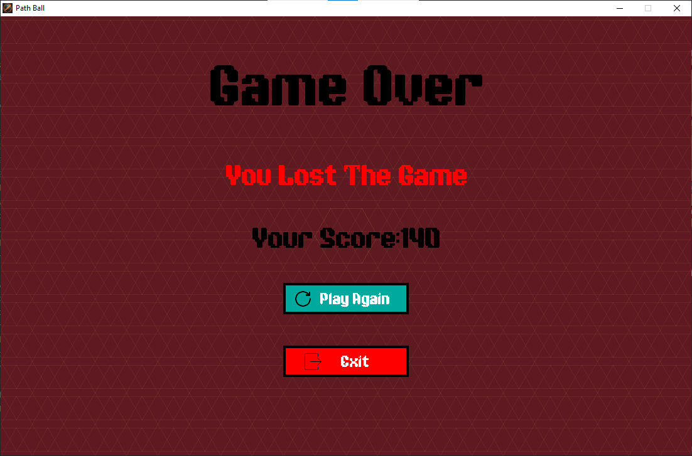
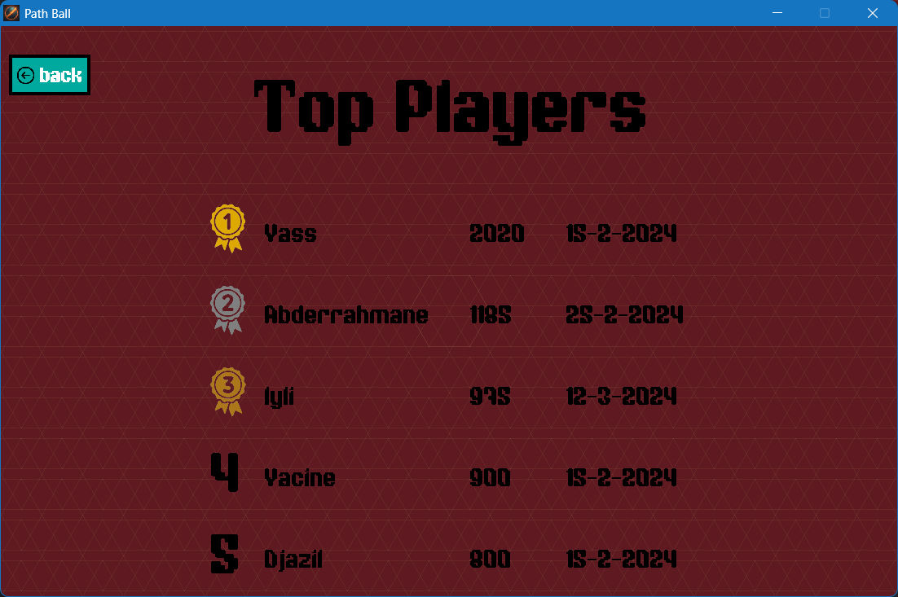

# Path Ball Game

## Description

This is a game project for the University of Technology and Sciences Houari Boumediene (USTHB) in Algiers, Algeria. It's a 2D puzzle game made with SDL2 and C.

## Game Description

In Path Ball, your objective is to remember the positions of various bumpers before they disappear. This task extends beyond simple memorization, requiring players to mentally simulate how the ball will rebound off these bumpers and predict its subsequent trajectory. This challenge not only tests your ability to retain information but also demands the analytical skill to interpret and anticipate the ball's movements, making it a cognitive exercise that involves both memory and strategic reasoning.

## How to play

The game is played with the mouse or keyboard. The player has to remember the position of the bumpers for a few seconds (3s default), then the bumpers disappear and the ball start position is shown. The player has to predict the path and the final position of the ball and click on it. The player has 3 lives; if he misses 3 times, he loses a level; if he wins 3 times in a row, he goes to the next level; losing in the first level means game over; winning the last level (10) means winning the game.

## Game Modes

- `Player Mode` : **The normal mode of the game , the player has to predict the path of the ball.**
- `Machine Auto Mode` : **The machine sets the bumpers and predicts the path of the ball and selects the final position.**
- `Machine Manual Mode` : **The Player sets the bumpers and chooses the start position of the ball and the machine predicts the path and selects the final position.**

**Note :** _In the machine modes,the machine never misses. Besides, the machine doesn't have access to the logic of the game (the game matrix), it only has access to the screen. It reads the pixels of the screen to get the positions of the bumpers and the start position of the ball and builds a different matrix to simulate the game._

## Controls

- `Player Mode` :
  - **Mouse**
    - **Select the final position of the ball :** Click on the final position of the ball.
  - **Keyboard**
    - **Select the final position of the ball :** Use the arrow keys to move the ball and press `Enter` to select the final position.
- `Machine Manual Mode` :
  - **Mouse**
    - **Set the bumpers :** Click on the grid to set the bumpers, 1 click to set a bumper, 2 clicks to switch its direction, 3 clicks to remove it.
    - **Set the start position of the ball :** Click on the circle to set the start position of the ball.
  - **Keyboard**
    - **Set the start position of the ball :** Use the arrow keys to move the ball and press `Enter` to set the start position of the ball.
- `Pause` :
  - **Keyboard**
    - **Pause the game :** Press `P` to pause the game.
- `Skip Ball Path Display` :
  - **Keyboard**
    - **Skip the ball path display :** Press `S` to skip the ball path display.
- `Exit` :
  - **Keyboard**
    - **Exit the game :** Press `F10` to exit the game.

## Folder Structure

- `src/` : Contains all the source files.
- `include/` : Contains all the header files.
- `assets/` : Contains all the assets used in the game.
- `bin/` : Contains the executable file (and the dlls for windows) after building the project.
- `Makefile` : Makefile for the project (compile, clean, etc...)
- `archive/` : Contains old files (not used anymore) that represent the old version of the game.

## Files Description

- `main.c` : The main file of the game that contains the main loop.
- `logic.c` : Contains the game logic (matrix manipulation, ball movement, score, etc...)
- `draw.c` : Contains the drawing functions (draw Grid, draw main menu, etc...)
- `render.c` : Contains the rendering functions (rendering the main menu, the game mode ...)
- `handlers.c` : Contains the event handling functions (keyboard, mouse, etc...)
- `util.c` : Contains the utility functions (formatting, etc...)

**<u>Each file has a corresponding header file in the</u> `include/` <u>folder except for</u> `main.c`, <u>header files
are named the same as the source file but with a</u> `.h` <u>extension and contain the macros (constants), the structures and type definitions, the function prototypes with documentation and the includes.</u>**

## Dependencies List

- `SDL2` : The main library used for the game. [install](https://github.com/libsdl-org/SDL/tree/SDL2)
- `SDL2_image` : Used for loading images. [install](https://github.com/libsdl-org/SDL_image)
- `SDL2_ttf` : Used for rendering text. [install](https://github.com/libsdl-org/SDL_ttf)
- `SDL2_mixer` : Used for playing sounds. [install](https://github.com/libsdl-org/SDL_mixer)
- `mingw32 (gcc)` : C language compiler. [install](https://sourceforge.net/projects/mingw-w64/)

## How to build

- **Run `make` in the root directory of the project.
  if it didn't work, try to run `mingw32-make` instead.**

- **For windows, don't forget to add the dlls to the `bin/` folder (not included in the repository).**

## Authors

-`Yahiaoui Abderrahmane` : **[GitHub](https://github.com/Abdo30004) / [Discord](https://discordapp.com/users/760952710383665192)**

-`Oubyi Mohamed Yacine` : **[GitHub](https://github.com/YassWrld) / [Discord](https://discordapp.com/users/989586655612645467)**

## Screenshots

#### Main Menu

#### Main Game

#### Game Over

#### Top Players

## License

[**MIT**](https://choosealicense.com/licenses/mit/)
